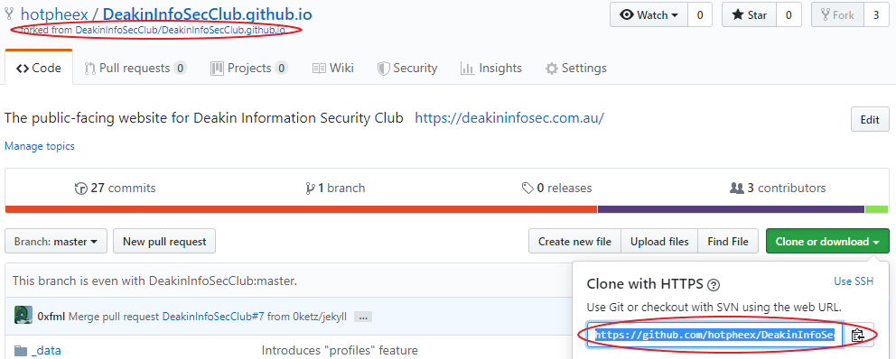
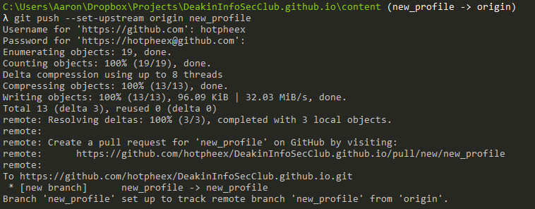

*(Or any git project for that matter...)*

*- Written by [@hotpheex](/kb/profiles/hotpheex)*

If you get stuck with any of the steps below, don't hesitate to shout out on [Slack](http://discclub.slack.com) for a hand, there are plenty of people willing to help!

**Note:** Anywhere that you see the `<` or `>` characters, those are for you to swap out with something (do not keep the brackets).

### Contents
* [Set up a local working copy](#set-up-a-local-working-copy)
* [Add your profile to the KB](#add-your-profile-to-the-kb)
* [Make that pull request!](#make-that-pull-request)
* [Time to get creative](#time-to-get-creative)

### Prerequisites
For this recipe we are going to need a few basic ingredients:
* You will to [create a Github account](https://github.com/join) if you don't have one already.
* Make sure you have `git` [installed on your computer](https://gist.github.com/derhuerst/1b15ff4652a867391f03).
* A working internet connection (Australian speeds will do).
* 10 minutes of free time.

<br class="spacer"/>

### Set up a local working copy
First we need to [fork](https://help.github.com/en/articles/fork-a-repo) the official DISC Github repository so that we can develop our new features under our own account.

* Browse to the [DISC repository](https://github.com/DeakinInfoSecClub/DeakinInfoSecClub.github.io), and click the *Fork* button.
    

* Copy the URL for your newly forked repository (make sure you're copying your personal repository, not the URL for the official one).
    

* Now in a terminal, use the `git clone` command to download a copy of your new forked repository.
```
git clone <YOUR URL>
```
    

* Change directories into your newly created local repo
```
cd DeakinInfoSecClub.github.io
```

* Next we need to set the remote *upstream* to the original DISC repository, so that we can pull down any changes made to it and keep ours in sync.
```
git remote add upstream git@github.com/DeakinInfoSecClub/DeakinInfoSecClub.github.io.git
```

<br class="spacer"/>

### Add your profile to the KB
First thing's first, lets add your personal profile to the KB so that your article will link to your deets, and people can easily find all of your awesome contributions!
* Start by creating a new branch for the feature you're adding.
*It is good practice to never push straight to the master branch. Name your new branch something that makes sense.*
```
git checkout -b new_profile
```

* Create a new text file in your preferred text editor, and copy the template below into it:

      ---
      title: <handle>
      external_url: <your url>
      twitter: <twitter username>
      github: <github username>
      htb: <hack the box account #>
      ---

      <A few words about yourself!>

* Edit the various fields between the `<>` characters with your own details. Don't worry if you don't have a twitter or htb account, just leave them blank for now!

* Save it under the `content/_profiles/` directory, named `<your handle>.md`

* Index the new file you've just created, staging it for the next commit.
```
git add -A
```

* Commit your changes to your branch, with a meaningful message for the changes you have made.
```
git commit -m "added my kb profile"
```

* Now push the changes to your remote origin repository! (Enter your github username & password when prompted)
```
git push origin <branch name>
```
  

<br class="spacer"/>

### Make that pull request!

Finally, make a pull request to the upstream repository. This is a request for the maintainers of the official repository to accept your changes and merge them into the main repo!
* Browse to your forked repository (same URL that you `git clone`'d), make sure your new branch is selected, then hit "New pull request"
  

* Fill in a meaningful title & description, review the changes you are pushing by scrolling down, then finally hit the "Create pull request" button!
  

Once your pull request has been made, you will have to wait until one of the official maintainers approves the request to merge your branch into the upstream repository. So sit tight, they'll get to it soon!

<br class="spacer"/>

### Time to get creative
Now you just need to make some stuff!!

* As usual when starting on a new feature, create a new branch with a meaningful name. Since we are currently writing this article, I'll call the branch "contribute_tutorial".
```
git checkout -b contribute_tutorial
```

* Start off by copying the template below to the top of your article and filling in the relevant details:

      ---
      title: <title>
      author:
          - <authors handles>
      tags:
          - <tag1>
          - <tag2>
          - ...
      date: <yyyy-mm-dd>
      ---

* Save the working copy of your funky fresh new post in the appropriate directory, with a meaningful name (no spaces) and with the `.md` file extension:
    * `content/_articles` for Articles
    * `content/_cheatsheets` for Cheatsheets
    * `content/_workshops` for Workshops

* Write up the rest of your document:
    * Pages on this website are written in Markdown, and rendered into pretty HTML by the webserver, which means its extremely easy to build pages!
    * Take a look at the existing Markdown files in `content/_articles` for some inspiration on how these should be written.
    * [Markdown quick reference](https://en.support.wordpress.com/markdown-quick-reference/)
    * [Markdown detailed reference](https://github.com/adam-p/markdown-here/wiki/Markdown-Cheatsheet)

Follow the instructions on the main [README.md](https://github.com/DeakinInfoSecClub/DeakinInfoSecClub.github.io/blob/master/README.md) file on how to get a working version of the website running locally so you can test your new additions.

Once you are happy with your new page, repeat the same steps as above to:
* Add the changes to the local index `git add -A`
* Commit the changes to your branch `git commit -m "<commit message>"`
* Push the changes to your forked repo `git push origin <branch name>`
* Make a pull request to the upstream repo
    

Now we sit back, relax and wait for the contributors to approve your Pull Request.
Check back later and if they haven't budged, maybe give them a nudge on Slack :wink:
